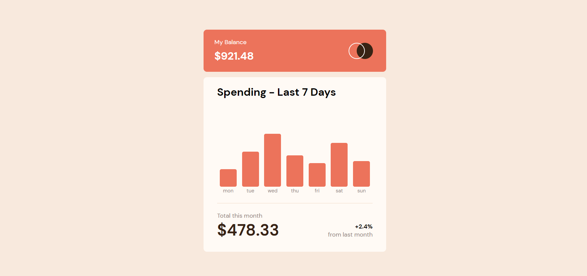
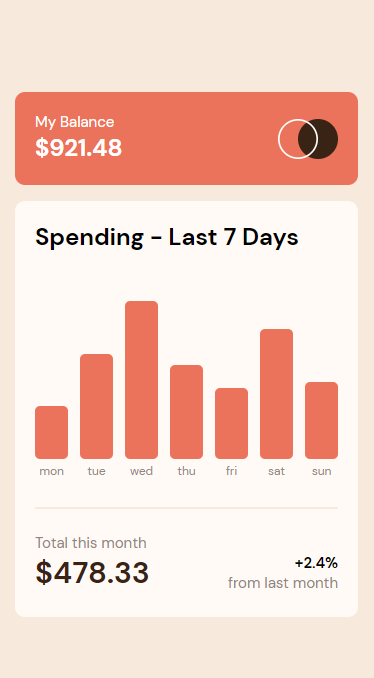

# Frontend Mentor - Expenses chart component solution

This is a solution to the [Expenses chart component challenge on Frontend Mentor](https://www.frontendmentor.io/challenges/expenses-chart-component-e7yJBUdjwt). Frontend Mentor challenges help you improve your coding skills by building realistic projects.

## Table of contents

- [Overview](#overview)
  - [The challenge](#the-challenge)
  - [Screenshot](#screenshot)
  - [Links](#links)
- [My process](#my-process)
  - [Built with](#built-with)
  - [What I learned](#what-i-learned)
  - [Continued development](#continued-development)
  - [Useful resources](#useful-resources)
- [Author](#author)
- [Acknowledgments](#acknowledgments)

## Overview

### The challenge

Users should be able to:

- View the bar chart and hover over the individual bars to see the correct amounts for each day
- See the current day’s bar highlighted in a different colour to the other bars
- View the optimal layout for the content depending on their device’s screen size
- See hover states for all interactive elements on the page
- **Bonus**: Use the JSON data file provided to dynamically size the bars on the chart

### Screenshot

### Links

- Solution URL: [https://github.com/Kijimai/expenses-chart-react-vite](https://github.com/Kijimai/expenses-chart-react-vite)
- Live Site URL: [https://expenses-react-fem.netlify.app/](https://expenses-react-fem.netlify.app/)

## My process

### Built with

- ViteJS / React
- Styled Components
- Mobile-first workflow

### What I learned

I wanted to make this project using ViteJS and with styled components to get a feel for how both work. ViteJS is a faster alternative to create-react-app which now I believe is my go to for building smaller scale projects to avoid those long development downtime. Styled components allow me to encapsulate css in each particular component making it that much easier to debug and edit the css for that component. The challenge came in how I would have created the logic for the floating amount display, and I ended up utilizing both javascript and css targeting to allow it to display on hover and in clicking the selected day.

## Author

- Website - [JibbyCodes](https://jdbucog.netlify.app/)
- Frontend Mentor - [@Kijimai](https://www.frontendmentor.io/profile/Kijimai)
